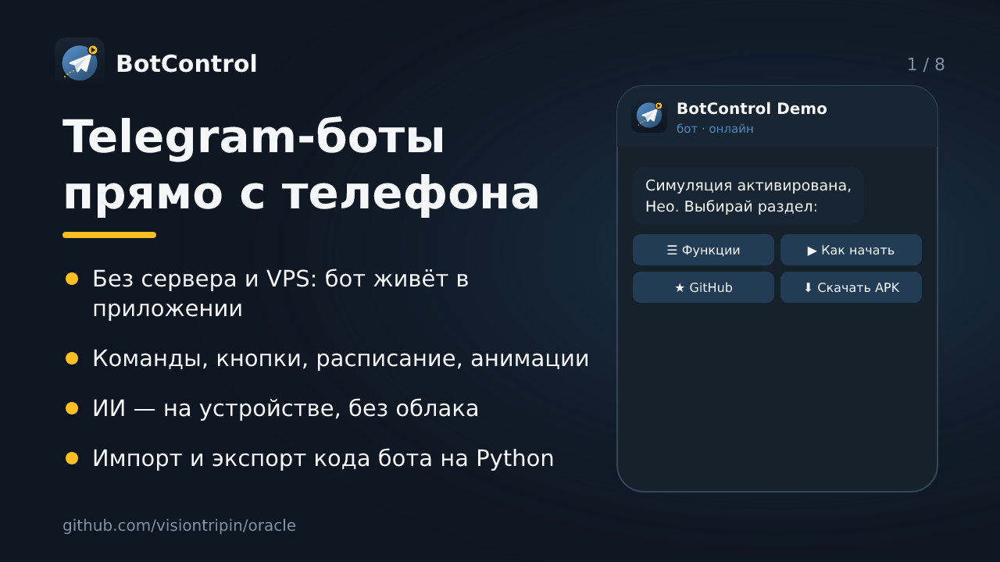

  

<h1 align="center">BotControl</h1>

<b>Telegram-боты прямо с телефона</b>: без сервера и VPS, команды, кнопки,
расписание, анимации, ИИ на устройстве.

  <a href="https://github.com/visiontripin/oracle/releases"><b>⬇️ Скачать APK</b></a> ·
  <a href="https://t.me/AppBotcontrol_bot"><b>🤖 Демо-бот @AppBotcontrol_bot</b></a> ·
  <a href="docs/index.html"><b>🌐 Страница проекта</b></a>

---

# oracle

Репозиторий — единственный источник истины по проекту **BotControl**
(Android-приложение: локальные Telegram-боты + LLM на устройстве +
конфиги ботов «кодом»).

## Куда смотреть

| Путь | Что там |
|---|---|
| [`tg-bot-control/ПЕРЕДАЧА-КОНТЕКСТА.md`](tg-bot-control/ПЕРЕДАЧА-КОНТЕКСТА.md) | **читать первым делом**: состояние, карта файлов, грамматика импорта, требования, ловушки, история версий |
| [`tg-bot-control/`](tg-bot-control/) | сам проект: `android/` (исходники), `server/`, готовые конфиги `*.py`, доки |
| [`tg-bot-control/tools/kotlin-harness/`](tg-bot-control/tools/kotlin-harness/) | прогон импортёра (`PySource` / `ScriptImporter`) на Kotlin без Android SDK |
| [`tg-bot-control/tools/import-fixtures/`](tg-bot-control/tools/import-fixtures/) | конфиги-фикстуры для регрессионных проверок импорта |
| [`.github/workflows/botcontrol-apk.yml`](.github/workflows/botcontrol-apk.yml) | сборка APK в GitHub Actions + тег/релиз при `[apk]` в сообщении коммита |
| [`tg-bot-control/branding/`](tg-bot-control/branding/) | логотип (`logo.svg` — исходник), аватар бота, слайды презентации; генераторы `make_assets.py`, `make_android_icons.py` |
| [`tg-bot-control/presentation-bot-ready.py`](tg-bot-control/presentation-bot-ready.py) | бот-презентация для @AppBotcontrol_bot (слайды кнопками, демо анимаций) |
| [`docs/`](docs/) | веб-страница проекта (GitHub Pages из `/docs`) |
| [`task.txt`](task.txt) → [`docs/matrix-links.html`](docs/matrix-links.html) | страница-хаб «Matrix Links» (ORACLE → DAROMVPL → BotControl App → ONEDOPEA): неоновый логотип BotControl в цикле и кнопка GitHub; `docs/matrix-links.html` — точная копия `task.txt` для Pages |
| [`tg-bot-control/tools/check-bot-isolation.py`](tg-bot-control/tools/check-bot-isolation.py) | проверка изоляции ботов (шаг CI перед сборкой): сервис не должен читать настройки «активного» бота вместо своего |

> Устаревшие копии (корневой `ПЕРЕДАЧА-КОНТЕКСТА.md`, `botcontrol-handoff.zip`,
> неработающий вложенный workflow) удалены в v1.6.3 — они есть в истории git.
> Восстановление workspace — только из git.

## Сборка и доставка

Собрать локально нельзя (в песочнице закрыты Google Maven и Maven
Central), поэтому APK собирается в GitHub Actions. Рецепт, проверка aapt и
получение APK из тега — раздел 4 файла
`tg-bot-control/ПЕРЕДАЧА-КОНТЕКСТА.md`.

Текущая доставка: **v1.6.3 (versionCode 30)**, тег
`botcontrol-v1.6.3-code30`. Следующий versionCode — **31**.

## Безопасность

Токены ботов и любые живые ключи в git не попадают. Исключение из прошлого —
удалённый `botcontrol-handoff.zip`: токен из него остался в истории git и
должен быть отозван через @BotFather (`/revoke`). В репозитории лежит
только debug-keystore для воспроизводимой подписи debug-APK.
